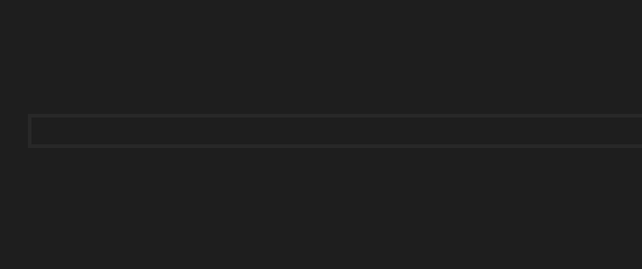
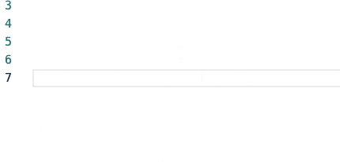

# VSCODE CURSOR DECORATOR!!!

Learn from repo [Power Mode](https://github.com/hoovercj/vscode-power-mode) but only leave the CURSOR DECORATOR!!

The original repo have not updated for so many years. And the biggest problem is that it cannot read gif from local filesystem. So I made some updates and fix some bugs.

And only leave one default decorator:

To enable, add `"cursordecorator.enabled": true` to your settings.

## Updates:
* Only leave the cursor decorator. Remove the shake, combo bar and so on.
* Can set gif path in local filesystem.
* Gif can follow the selection even no typing.
* Use a manual queue to speed up.
* Add a css cache to speed up.
* Much more Customizable

## Choose Your Own Gifs:

This is what I'm using now, lol.

## Configuration:
The main popurse for this extension is that you can set your own gif which would follow the cursor.

All of the options are explained below:

* `cursordecorator.enabled`: enable this to enable the Cursor Decorator
* `cursordecorator.customGifs`: Choose your own gifs with base64 encoded gifs or full URIs **or a local file** (i.e. "data:image/gif;base64,1337GIF", **"/path/to/gif"**, "https://coolgif.io") 
* `cursordecorator.maxGifs`: Reducing this will reduce the number of gifs rendered at the same time.
* `cursordecorator.gifSize`: Set the gif size in ch.
* `cursordecorator.gifFrequency`: Increasing this will increase the number of keystrokes between explosions. It means that there will be gaps between explosions as you type but may help performance. If you set it to 2, then every 2 strike the gif would refresh once. 
* `cursordecorator.xOffset`: The horizontal offset of the gifs. Increasing it will move the gifs right, decreasing it will move them left.
* `cursordecorator.yOffset`: The vertical offset of the gifs. Increasing it will move the gifs up, decreasing it will move them down.
* `cursordecorator.backgroundMode`: `mask` will use the gif as a mask, letting the shape of the gif through with the color of the text. `image` will use the gif itself as the background.
* `cursordecorator.gifOrder`: `sequential` will cycle through explosions in order, `random` will pick one randomly, and providing a number will select the explosion at that (zero-based) index in the list of explosions.
* `cursordecorator.gifDuration`: Determines how long an gif lasts (in milliseconds). Set to 0 for it to last forever.
* `cursordecorator.customCss`: Changes the CSS applied to the "after" pseudoelement. You can experiment with ways to make it look or perform better.

